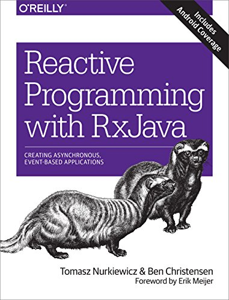
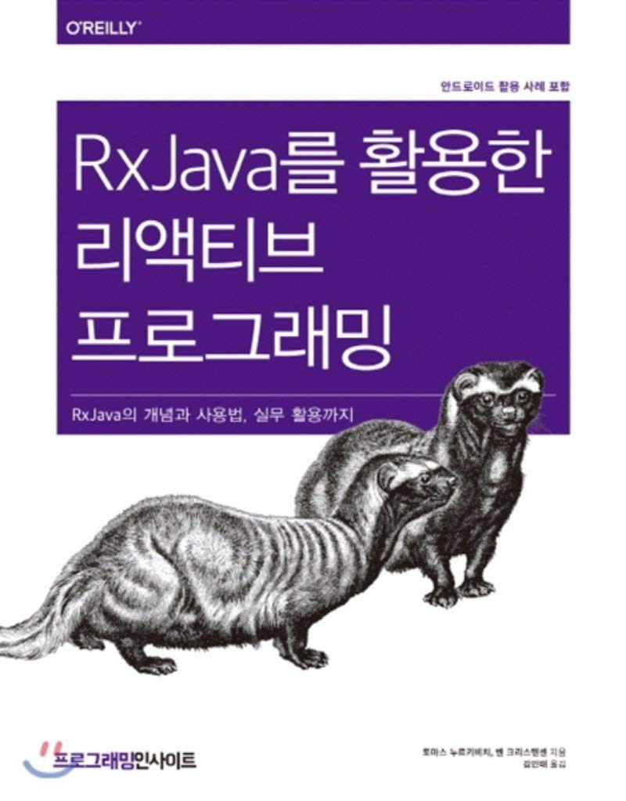

# About me

**Tomasz Nurkiewicz**, Java Champion, CTO at [DevSkiller](https://devskiller.com/), trainer, [O’Reilly author](https://www.oreilly.com/library/view/reactive-programming-with/9781491931646/), [conference speaker](/talks), [blogger](/articles).

Spent half of his life on programming, for the last decade professionally in Java land.
Loves back-end and data visualization. 
Passionate about alternative JVM languages.
Disappointed with the quality of software written these days (so often by himself!), hates long methods and hidden side effects.
Interested in charting, data analysis, and reactive programming. 
Believes that computers were invented so that developers can automate boring and repetitive tasks. 
Also their own.

Involved in open-source, DZone’s Most Valuable Blogger, used to be [very active on StackOverflow](https://stackoverflow.com/users/605744/tomasz-nurkiewicz). 
Claims that code not tested automatically is not a feature but just a rumour. 

## My book

I wrote a [book about RxJava](https://www.amazon.com/Reactive-Programming-RxJava-Asynchronous-Applications/dp/1491931655), also translated to [Korean](https://www.amazon.com/Reactive-programming-using-RxJava-Korean/dp/8966263062).

## Hire me

I'm occasionally doing [Reactor](https://github.com/nurkiewicz/reactor-workshop), [Java concurrency](https://github.com/nurkiewicz/java-concurrency-workshop) workshops and consulting.
I trained almost **1000** people from companies around the world.
If you find my work valuable or need some help, contact me.

## Contact me

* E-mail: `nurkiewicz` (on GMail)
* [Mastodon](https://fosstodon.org/@nurkiewicz) or [Twitter](https://twitter.com/tnurkiewicz) (DMs open)
* [LinkedIn](https://www.linkedin.com/in/tomasz-nurkiewicz-80513b92/)
